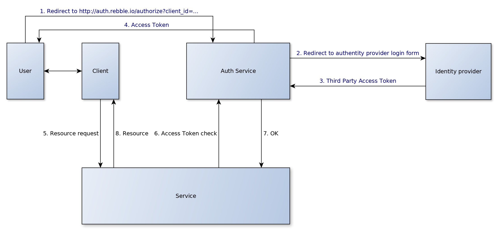

Authentication system
=====================

The authentication is provided by several SSOs (such as Google or Fitbit) through the OpenID protocol.

Behavior
--------



The client must get its authentication grant and access token with the OAuth provider.

To access a backend resource which requires authentication, the client must provide an access token as well as the name of the SSO provider.  
The backend then independently checks the validity of the access token and retrieves user information.

If the account does not yet exist in the database, it is automatically created.

Key settings
------------

You should fill your client ID and secret keys in the `rebblestore-api.json` file.

API
---

### `/user/client_ids`

Returns the list of SSO client IDs for the frontend to use

Query: Simple `GET` request

Response:
```JSON
{
    "ssos": [
        {
            "name": "google",
            "client_id": "<client id>",
            "discover_uri": "<discover uri>"
        },
        ...
    ]
}
```

### `/user/login`

Create a user session tied to the provided authentication code (once the access token expires, so does the session).

The authentication code is returned from an implicit OpenID/OAuth request to one of the SSOs (see [google's documentation page](https://developers.google.com/identity/protocols/OpenIDConnect#sendauthrequest) for more information).

The authentication service will handle the rest of the authentication with the SSO, and return an access token to use Rebble services.

Query:
```JSON
{
    "code": "<authentication code>",
    "authProvider": "<OpenID provider>"
}
```

Response:
```JSON
{
    "accessToken": "<access token>",
	"success": boolean,
	"errorMessage": "<error message>"
}
```

### `/user/info`

Request information about the user.

Query:
```JSON
{
    "accessToken": "<access token>",
}
```

Response:
```JSON
{
    "loggedIn": boolean,
    "name": "<name>",
    "errorMessage": "<Error message>"
}
```
If the user is not logged in (the access token is invalid or the associated access token from the SSO has been invalidated), name will be blank and an error message will be provided.  
Otherwise "errorMessage" will be blank.

### `/user/update/name`

Change the logged in user's name. Empty field is allowed.

Query:
```JSON
{
    "accessToken": "<access token>",
    "name": "<Name>"
}
```

Response:
```JSON
{
	"success": boolean,
	"errorMessage": "<error message>"
}
```

### `/user/name/{id}`

Gets user `{id}`'s name

Response:
```JSON
{
    "name": "<name>",
    "errorMessage": "<error message>"
}

If an error occured when retrieving the name (such as invalid id), the name will be blank and the error message will be set accordingly.
```

SQL Structure
-------------

See `rebbleHandlers/admin.go`

* `users` contains the user account information;
* `userSessions` contains all active session (*however, an active session is not necessarily a valid session; the access_token might be invalid);
* `userLoginLog` contains a log of all user logins for administrative purposes.